#Выполнил: Николаев Роман ИС-22

### Инструкция к выполению

### **Задача 1. Подготовка окружения**  
- Докер файл в репозитории
- Скрины сервисов:
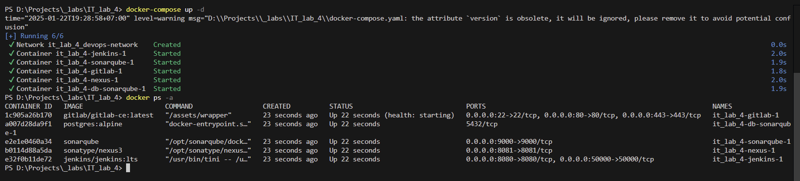
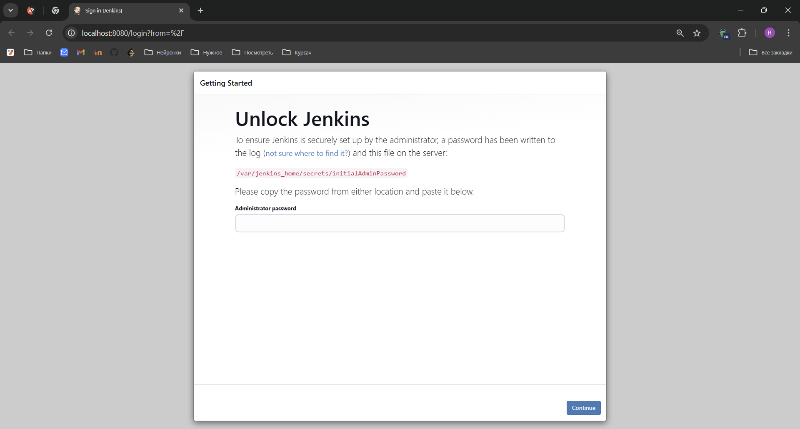
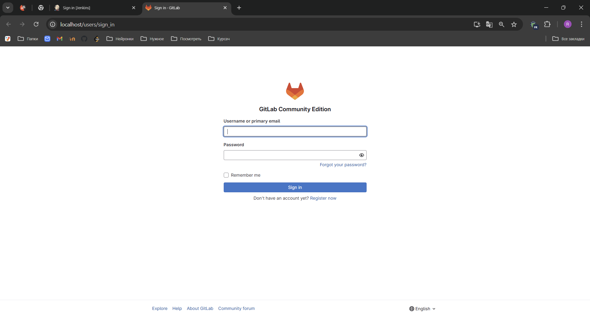
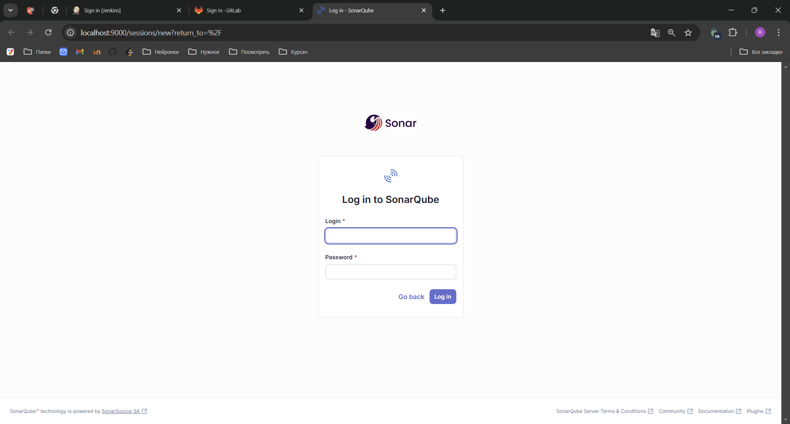
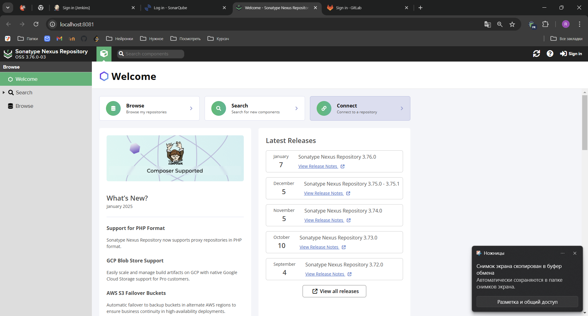
---

### **Задача 2. Создание Python-приложения**  

---

### **Задача 3. Интеграция инструментов**  
#### **GitLab CI/CD**  
1. Настройте `.gitlab-ci.yml`:  
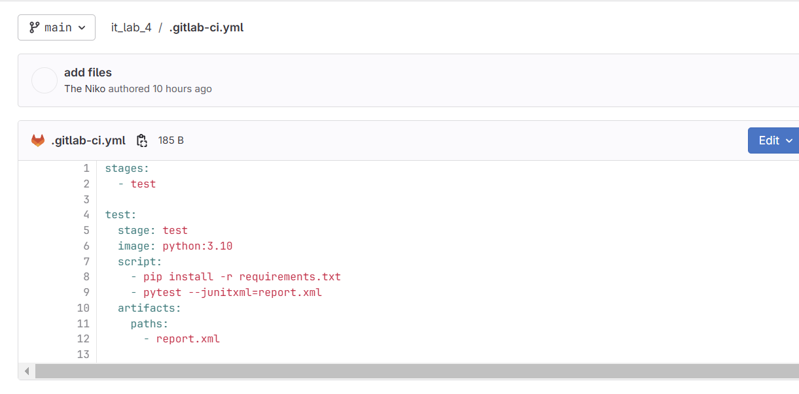

Проверки запускаются:
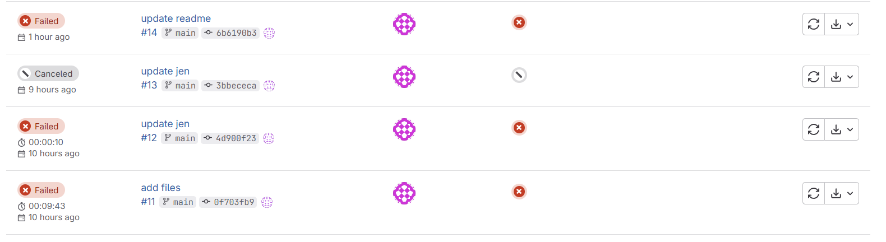
Но выдают такую ошибку:
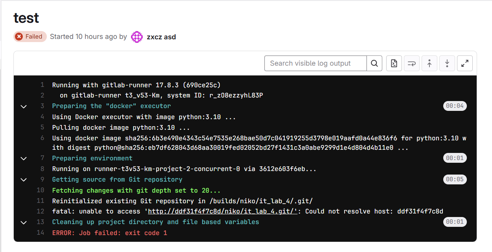
Я устанавливал gitlab runner с на свой пк и через образ докера, менял url и на localhost, и на id контейнера, и на название контейнера в config файле ранера, но ошибку пофиксить не получилось.
  
#### **Jenkins**  
```
pipeline {
    agent any
    stages {
        stage('Clone Repository') {
            steps {
                git url: 'http://172.17.0.1/niko/it_lab_4.git', branch: 'main'
            }
        }
        stage('Install Dependencies') {
            steps {
                sh 'pipx install pytest'
            }
        }
        stage('Run Tests') {
            steps {
                sh 'pytest --junitxml=report.xml'
            }
        }
    }
    post {
        always {
            junit 'report.xml'
        }
    }
}
```

Результаты тестов: 
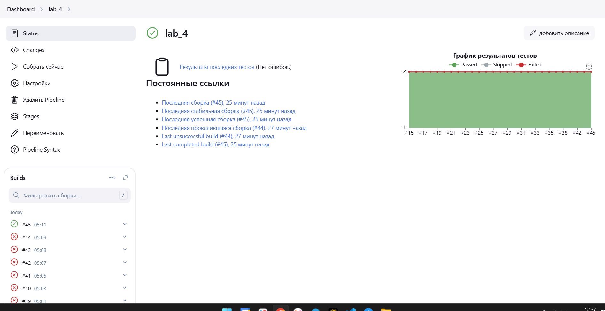

Консольный вывод:
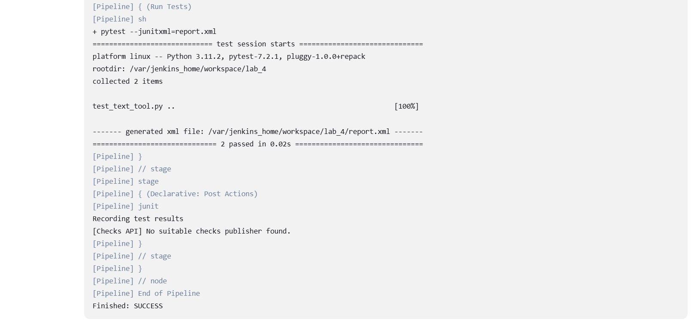

---

### **Задача 4. Анализ кода с SonarQube**  

Получил ключи SonarQube:
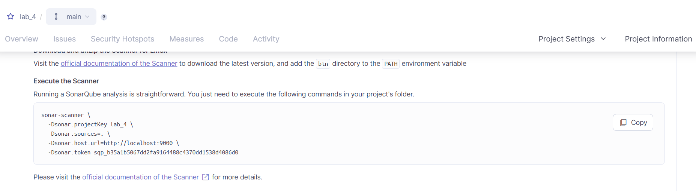


Обновил jenkinsfile:
```
pipeline {
    agent any
    stages {
        stage('Clone Repository') {
            steps {
                git url: 'http://172.17.0.1/niko/it_lab_4.git', branch: 'main'
            }
        }
        stage('Install Dependencies') {
            steps {
                sh 'pipx install pytest'
            }
        }
        stage('Code Analysis') {
            steps {
                sh '''
                    sonar-scanner \
                    -Dsonar.projectKey=lab_4 \
                    -Dsonar.sources=. \
                    -Dsonar.host.url=http://localhost:9000 \
                    -Dsonar.token=sqp_b35a1b5067dd2fa9164488c4370dd1538d4086d0
                    '''
           }
        }
        stage('Run Tests') {
            steps {
                sh 'pytest --junitxml=report.xml'
            }
        }
    }
    post {
        always {
            junit 'report.xml'
        }
    }
}

```

Мне выдаёт ошибку:
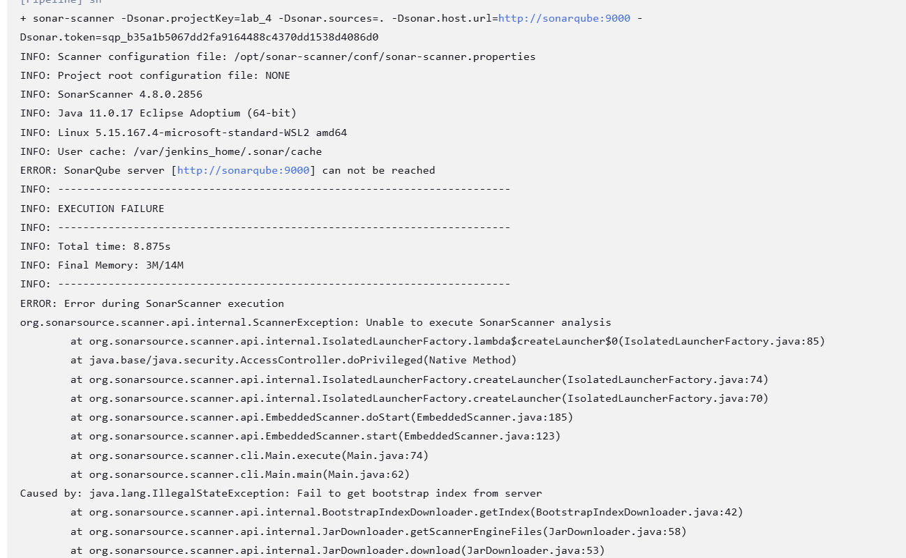
Я по разному пытался исправить, починить не получилось